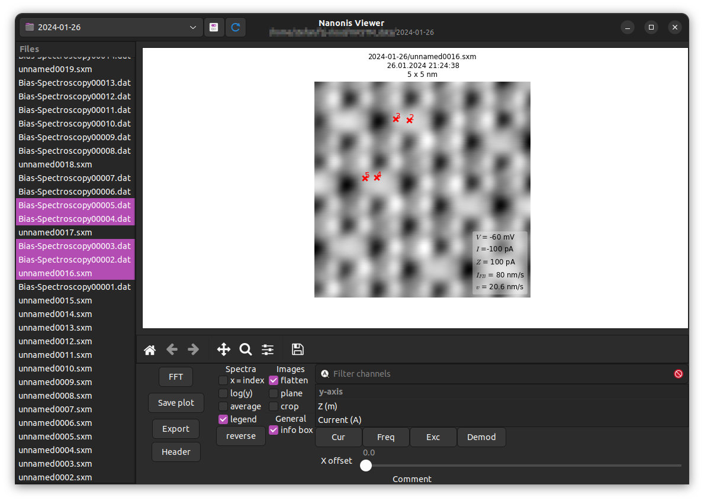
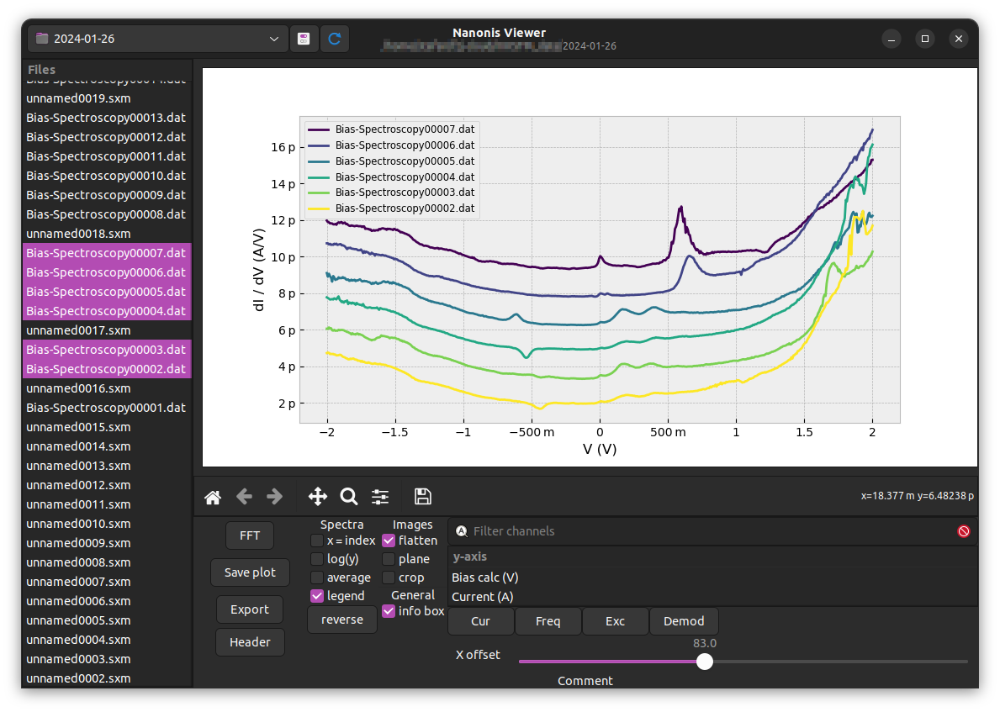
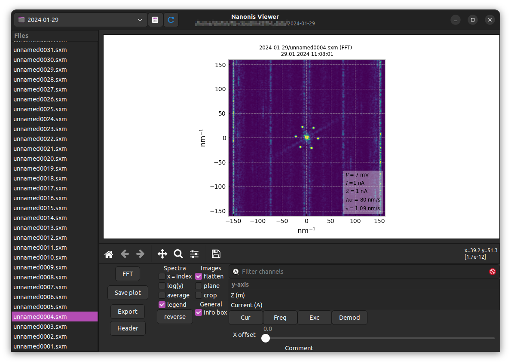

# Nanonis Viewer

Welcome to NanonisViewer a small program that allows you to quickly view images and spectra saved by Specs Nanonis software (https://www.specs-group.com/nanonis/). NanonisViewer works best if you save your files in one directory, that you can select to browse all viewable files. 

## Screenshots
 




## Installation

### Windows and Linux binaries

For Windows and Linux users, an executable binary versions are available on the release page. Just download the whole folder and run NanonisViewer from within. Linux version was tested on Ubuntu 22.04.

### Conda

If you are using a conda python environment you can install the necessary dependencies by
```
conda install scipy pyaml pandas gtk3 matplotlib pygobject adwaita-icon-theme
```
You can then run NanonisViewer.py from within that environment.

### Linux

If you want to run the python file directly make sure you have a working installation of PyGObject (https://gnome.pages.gitlab.gnome.org/pygobject/getting_started.html).
Other dependencies are installed with the following pip command:
```
pip install scipy pyaml pandas matplotlib
```

## Usage
Usage of NanonisViewer is rather intuitive. Select the folder your data files are in and click on a specific file to view it. If the default channel is present in that file, it will already be plotted. Otherwise, select the respective channel from the list. Selecting multiple files as well as channels is also possible.
Basic image analysis is available in the main window. Flatten, plane level or crop the images or calculate the 2D FFT.
The save button save a .png image in the export subfolder of your working directory and copies it to the clip board automatically

## Settings
The file extensions NanonisViewer is looking for, the default channels and colormaps can be changed from the settings window. FFT settings allow you to change the window function that is applied to the image before calculating the FFT as well as the cut-off level of the finial FFT plot.

## Support
If you have problems with NanonisViewer or find a bug you can message me at st.schulte@fz-juelich.de.
Is NanonisViewer working for you and helping you in your research? Drop a message, too!
